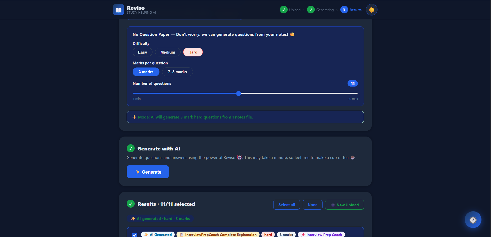

<div align="center">

# 📖 Reviso
### Upload Notes. Get Answers.

**Reviso is a free AI-powered study tool that reads your notes and either answers your question paper or generates possible exam questions — then exports everything as a clean PDF.**

[](https://reviso.vercel.app)
[](https://reviso-backend-y07n.onrender.com)
[](https://github.com/Niranjana-11/Reviso)
[](LICENSE)




</div>

---

## ✨ Features

- 📓 **Upload multiple notes** — PDF or PPTX files, all processed together
- 📝 **Upload question papers** — AI answers every question using your notes
- ✨ **Generate possible questions** — when no QP, AI creates exam questions
- 📋 **Per-note tagging** — questions tagged with which notes file they came from
- 🎚️ **Full control** — choose difficulty, marks (3 or 7-8), and question count (1-20)
- 📊 **Smart answers** — 3-mark questions get concise answers, 7-8 mark questions get detailed 200+ word structured answers
- 📄 **Download PDF** — beautifully formatted study sheet with all selected Q&A
- 🌙 **Dark / Light mode** — follows system preference, remembers your choice
- 💾 **Session history** — saved locally and online via Supabase
- ✨ **PPTX auto-conversion** — PowerPoint slides converted to PDF automatically
- 🔄 **Multi-file upload** — add, replace, or remove files individually
- ➕ **New upload without refresh** — generate new Q&A without refreshing the page
- ☕ **Smart wake-up** — auto-detects when server is sleeping and retries automatically

---

## 🚀 How it works

```
WITH Question Paper:
  notes.pdf + qp.pdf
      ↓
  AI reads both
      ↓
  Answers every QP question using ONLY your notes
  (3-mark → concise, 7-mark → detailed 200+ words)
      ↓
  Download PDF ✅

WITHOUT Question Paper:
  notes.pdf + difficulty + marks + count
      ↓
  AI generates possible exam questions per notes file
  Each question tagged with source notes name
      ↓
  Download PDF ✅
```

---

## 🛠️ Tech Stack

| Layer | Tool | Cost |
|-------|------|------|
| AI Model | Groq + Llama 3.3 70B Versatile | Free |
| Backend | FastAPI + Uvicorn | Free |
| PDF Reading | pdfplumber | Free |
| PDF Creation | ReportLab | Free |
| PPTX Conversion | python-pptx + Pillow | Free |
| Frontend | React + Vite | Free |
| Database | Supabase (PostgreSQL) | Free |
| Backend Hosting | Render | Free |
| Frontend Hosting | Vercel | Free |
| Keep-Alive | GitHub Actions (cron ping) | Free |
| Code Hosting | GitHub | Free |
| **Total Cost** | | **$0** 🎉 |

---

## 📁 Project Structure

```
Reviso/
├── .github/
│   └── workflows/
│       └── keepalive.yml        # Pings Render every 5 min to prevent sleep
├── backend/
│   ├── main.py                  # FastAPI routes — unified upload+generate
│   ├── requirements.txt         # Pinned Python dependencies
│   └── services/
│       ├── pdf_extractor.py     # Extract text from PDFs (pdfplumber)
│       ├── qa_engine.py         # Groq AI — two modes, detailed answers
│       ├── pdf_builder.py       # ReportLab PDF output — blue academic theme
│       └── pptx_converter.py    # PPTX → PDF conversion (python-pptx)
├── frontend/
│   ├── src/
│   │   ├── App.jsx              # Main UI — 3-step wizard
│   │   ├── hooks/
│   │   │   ├── useReviso.js     # All app state + logic
│   │   │   └── useTheme.js      # Dark/light mode with localStorage
│   │   ├── components/
│   │   │   ├── Header.jsx       # Sticky header + step indicator + theme toggle
│   │   │   ├── FileList.jsx     # Multi-file upload zone with per-file cards
│   │   │   ├── ModeControls.jsx # Difficulty + marks + count slider
│   │   │   ├── QuestionCard.jsx # Q&A card with checkbox + note source tag
│   │   │   ├── HistoryPopup.jsx # Floating history button + popup
│   │   │   ├── BackendStatus.jsx # Wake-up banner with countdown timer
│   │   │   └── ErrorBanner.jsx  # Error display
│   │   └── utils/
│   │       ├── api.js           # Fetch wrapper with auto-retry
│   │       └── supabase.js      # History save/load (local + online)
│   ├── index.html
│   ├── vercel.json              # SPA routing config
│   └── vite.config.js
├── .gitignore
└── README.md
```

---

## 🏃 Run Locally

### Prerequisites
- Python 3.10+
- Node.js 18+
- Free [Groq API key](https://console.groq.com)
- Free [Supabase](https://supabase.com) project (for history)

### Backend
```bash
cd backend

# Create virtual environment
python -m venv venv
source venv/bin/activate    # Windows: venv\Scripts\activate

# Install dependencies
pip install -r requirements.txt

# Set environment variables
echo "GROQ_API_KEY=your_key_here" > .env

# Run server
python main.py
# → http://localhost:8000
# → http://localhost:8000/docs  (Swagger UI — test all routes)
```

### Frontend
```bash
cd frontend

# Install dependencies
npm install

# Run dev server
npm run dev
# → http://localhost:5173
```

---

## ☁️ Deploy (Free)

### Step 1 — Get Free API Keys

| Service | URL | What for |
|---------|-----|----------|
| Groq | [console.groq.com](https://console.groq.com) | AI model (free 14k req/day) |
| Supabase | [supabase.com](https://supabase.com) | Session history database |

### Step 2 — Backend → Render

1. Push repo to GitHub
2. Go to [render.com](https://render.com) → New → Web Service
3. Connect your GitHub repo
4. Configure:

| Setting | Value |
|---------|-------|
| Root Directory | `backend` |
| Runtime | `Python 3` |
| Build Command | `pip install -r requirements.txt` |
| Start Command | `uvicorn main:app --host 0.0.0.0 --port $PORT` |
| Instance Type | `Free` |

5. Add Environment Variable: `GROQ_API_KEY` = your key
6. Deploy ✅

### Step 3 — Frontend → Vercel

1. Go to [vercel.com](https://vercel.com) → New Project → Import repo
2. Set Root Directory: `frontend`
3. Add Environment Variable: `VITE_API_URL` = your Render URL
4. Deploy ✅

### Step 4 — Keep Render Awake (GitHub Actions)

The `.github/workflows/keepalive.yml` file automatically pings your Render backend every 5 minutes to prevent it from sleeping. No setup needed — just push to GitHub and it runs automatically.

---

## 🗄️ Supabase Setup

Run this SQL in your Supabase SQL Editor:

```sql
-- Create sessions table
create table sessions (
  id uuid default gen_random_uuid() primary key,
  created_at timestamp with time zone default now(),
  title text,
  mode text,
  difficulty text,
  marks integer,
  items jsonb
);

-- Enable Row Level Security
alter table sessions enable row level security;

-- Allow public access (no auth needed)
create policy "allow insert" on sessions for insert with check (true);
create policy "allow select" on sessions for select using (true);
create policy "allow delete" on sessions for delete using (true);
```

Then update `frontend/src/utils/supabase.js` with your project URL and publishable key.

---

## 🔑 Environment Variables

### Backend (`backend/.env`)
```
GROQ_API_KEY=gsk_your_groq_api_key_here
```

### Frontend (`frontend/.env.production`)
```
VITE_API_URL=https://your-render-app.onrender.com
```

---

## 📖 API Reference

| Method | Endpoint | Description |
|--------|----------|-------------|
| GET | `/` | Health check — returns app version |
| POST | `/generate/all` | Upload files + generate Q&A in one request |
| POST | `/download/pdf` | Export selected Q&A as styled PDF |

### `/generate/all` — Form Data Parameters

| Field | Type | Description |
|-------|------|-------------|
| `notes_files` | File[] | One or more notes PDFs/PPTXs |
| `qp_files` | File[] | Optional — question paper PDFs/PPTXs |
| `difficulty` | string | `easy` \| `medium` \| `hard` |
| `marks` | int | `3` or `7` |
| `count` | int | Questions per notes file (1-20) |

---

## 🧠 AI Answer Quality

Reviso generates answers based on marks weightage:

| Marks | Answer Style | Length |
|-------|-------------|--------|
| 3 marks | Concise, clear, direct | 4-6 sentences |
| 7-8 marks | Detailed, structured essay | 200+ words with intro, body, conclusion |

For QP mode — marks are auto-detected from the question paper text.

---

## 🕐 Session History

Every generated session is saved in two places:

| Storage | Access | Works offline |
|---------|--------|--------------|
| localStorage | This device only | ✅ Yes |
| Supabase | Any device | ❌ Needs internet |

Click the **🕐 floating button** (bottom right) to view, restore, or delete past sessions.

---

## 🛣️ Roadmap

- [ ] User authentication (login/signup per user)
- [ ] Save notes permanently per user account
- [ ] Chat with your notes (RAG)
- [ ] Mobile app (React Native)
- [ ] OCR support for scanned PDFs
- [ ] Multiple language support
- [ ] Share sessions with classmates
- [ ] Export to Word document

---

## 🐛 Troubleshooting

| Problem | Fix |
|---------|-----|
| "Server is waking up" banner | Wait 30 seconds — Render free tier sleeping. It retries automatically. |
| "Could not extract text" | Your PDF is a scanned image. Use a typed/digital PDF. |
| "AI returned no questions" | Notes PDF too short. Try a longer document. |
| History not syncing | Check Supabase URL and publishable key in `supabase.js` |
| Vercel build fails | Make sure Root Directory is set to `frontend` |
| PPTX conversion error | PPTX has special characters. Try saving as PDF first. |

---

## 🤝 Contributing

Pull requests are welcome!

```bash
# Fork and clone
git clone https://github.com/Niranjana-11/Reviso.git

# Create feature branch
git checkout -b feature/your-feature

# Make changes and commit
git commit -m "Add your feature"

# Push and open PR
git push origin feature/your-feature
```

---

## 📄 License

MIT License — free to use, modify, and distribute.

---

<div align="center">

Built with ❤️ by **Niranjana Rajesh**


⭐ **Star this repo if Reviso helped you study smarter!**

</div>
