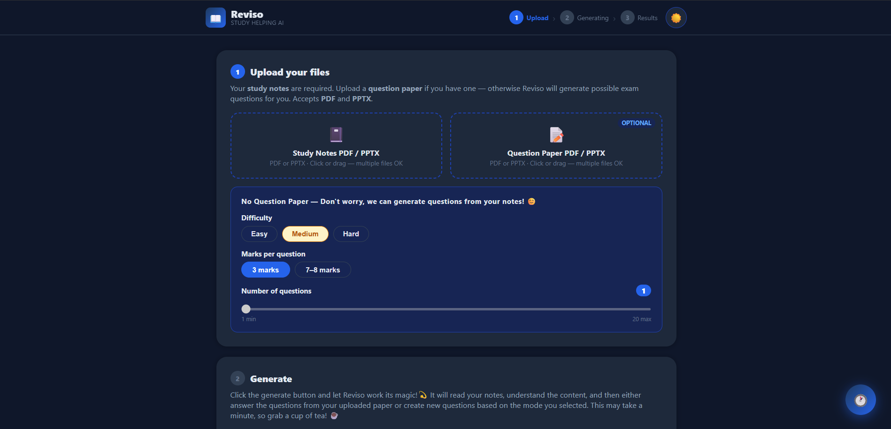

<div align="center">

# 📖 Reviso
### Upload Notes. Get Answers.

**Reviso is a free AI-powered study tool that reads your notes and either answers your question paper or generates possible exam questions — then exports everything as a clean PDF.**

[](https://reviso-smoky.vercel.app/)
[](https://reviso-backend-y07n.onrender.com)
[](LICENSE)



</div>

---

## ✨ Features

- 📓 **Upload multiple notes** — PDF or PPTX files combined automatically
- 📝 **Upload question papers** — AI answers every question using your notes
- ✨ **Generate possible questions** — when no QP, AI creates exam questions
- 🎚️ **Full control** — choose difficulty, marks (3 or 7-8), and question count
- 📄 **Download PDF** — beautifully formatted study sheet
- 🌙 **Dark / Light mode** — follows system preference, remembers your choice
- 💾 **Session history** — saved locally and online via Supabase
- ✨ **PPTX auto-conversion** — PowerPoint slides converted to PDF automatically
- 🔄 **Multi-file upload** — add, replace, or remove files individually

---

## 🚀 How it works
- **WITH Question Paper**: notes.pdf + qp.pdf → AI reads both → answers every QP question using only your notes → download PDF
- **WITHOUT Question Paper**: notes.pdf + difficulty + marks + count → AI generates possible exam questions → download PDF

---

## 🛠️ Tech Stack

| Layer | Tool | Cost |
|-------|------|------|
| AI Model | Groq + Llama 3.3 70B | Free |
| Backend | FastAPI + Uvicorn | Free |
| PDF Reading | pdfplumber | Free |
| PDF Creation | ReportLab | Free |
| PPTX Conversion | python-pptx | Free |
| Frontend | React + Vite | Free |
| Database | Supabase (PostgreSQL) | Free |
| Backend Hosting | Render | Free |
| Frontend Hosting | Vercel | Free |
| Code Hosting | GitHub | Free |
| **Total Cost** | | **$0** 🎉 |

---

## 📁 Project Structure
Reviso/
├── backend/
│   ├── main.py                  # FastAPI routes
│   ├── requirements.txt         # Python dependencies
│   └── services/
│       ├── storage.py           # File save/load
│       ├── pdf_extractor.py     # Extract text from PDFs
│       ├── qa_engine.py         # Groq AI — two modes
│       ├── pdf_builder.py       # ReportLab PDF output
│       └── pptx_converter.py    # PPTX → PDF conversion
├── frontend/
│   ├── src/
│   │   ├── App.jsx              # Main UI
│   │   ├── hooks/
│   │   │   ├── useReviso.js     # All app state
│   │   │   └── useTheme.js      # Dark/light mode
│   │   ├── components/
│   │   │   ├── Header.jsx       # Top bar + stepper
│   │   │   ├── FileList.jsx     # Multi-file upload zone
│   │   │   ├── ModeControls.jsx # Difficulty/marks/count
│   │   │   ├── QuestionCard.jsx # Q&A card with checkbox
│   │   │   ├── HistoryPopup.jsx # Session history popup
│   │   │   └── ErrorBanner.jsx  # Error display
│   │   └── utils/
│   │       ├── api.js           # Backend fetch wrapper
│   │       └── supabase.js      # History save/load
│   ├── index.html
│   ├── vercel.json
│   └── vite.config.js
├── .gitignore
└── README.md

---

## 🏃 Run Locally

### Prerequisites
- Python 3.10+
- Node.js 18+
- Free [Groq API key](https://console.groq.com)

### Backend
```bash
cd backend
python -m venv venv
source venv/bin/activate  # Windows: venv\Scripts\activate
pip install -r requirements.txt
echo "GROQ_API_KEY=your_key_here" > .env
python main.py
# → http://localhost:8000
# → http://localhost:8000/docs
```

### Frontend
```bash
cd frontend
npm install
npm run dev
# → http://localhost:5173
```

---

## ☁️ Deploy (Free)

### Backend → Render
1. Push repo to GitHub
2. [render.com](https://render.com) → New → Web Service
3. Connect repo, set:
   - Root Directory: `backend`
   - Build: `pip install -r requirements.txt`
   - Start: `uvicorn main:app --host 0.0.0.0 --port $PORT`
4. Add env var: `GROQ_API_KEY`
5. Deploy ✅

### Frontend → Vercel
1. [vercel.com](https://vercel.com) → New Project → Import repo
2. Set Root Directory: `frontend`
3. Add env var: `VITE_API_URL` = your Render URL
4. Deploy ✅

---

## 🛣️ Roadmap

- [ ] User authentication (login/signup)
- [ ] Save notes permanently per user
- [ ] Chat with your notes
- [ ] Mobile app (React Native)
- [ ] Support for scanned PDFs (OCR)
- [ ] Multiple language support
- [ ] Share sessions with friends

---

## 📄 License

MIT License — free to use, modify, and distribute.

---

<div align="center">

Built with ❤️ by **Niranjana Rajesh**

⭐ Star this repo if you found it helpful!

</div>
